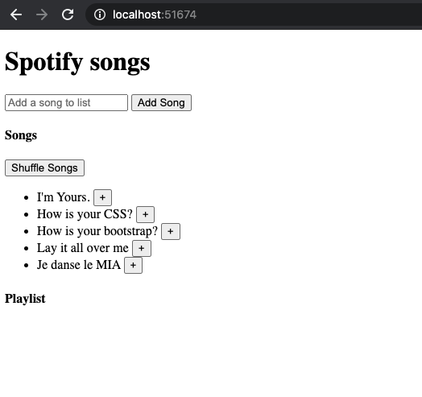

# Javascript Single Page Application (SPA) - Spotify

## Objectives
- Create a Single Page Application(SPA) for Spotify.
- You have a list of songs. You should be able to display those songs, add songs to your library, shuffle the songs and add songs to your playlist.
- Use an Immediately Invoked Function Expression(**IIFE**) to implement encapsulation/privacy.

## Preparation
1. Fork and clone.
2. Run `npm install`.
	 *This will install javascript packages needed during development like grunt, jasmine, etc.*
3. Run `parcel index.html` to start the server
4. The starter code is in `index.js` and `spotify.js`. These are suggested ways to start. Feel free to modify as you wish.

## Build the features for your app (work through them in order)
1. Display all songs when user opens the page
2. Allow user to add new songs to the list
3. Add a shuffle button to allow user to shuffle the songs in the main songs list
4. Allow user to create a customized playlist

The basic page should look something like this.

## Further
Style the page with bootstrap!
